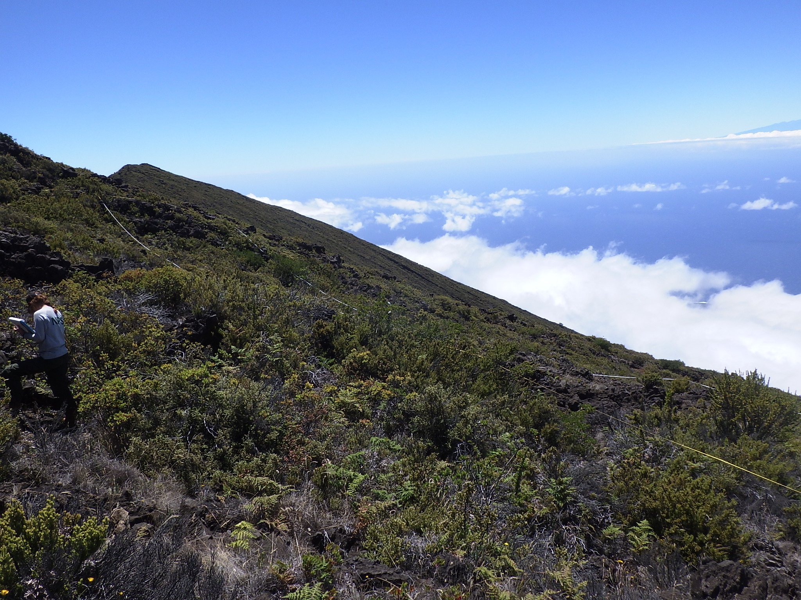

```{r setup, include=FALSE}
knitr::opts_chunk$set(echo = TRUE)
```

```{r packages, include=FALSE}
#library(tidyverse)
library(kableExtra)
library(leaflet)
library(pacnvegetation)
library(bookdown)
library(tidyverse)
library(here)
library(plotly)
library(treemapify)
library(data.table)
library(DT)
```

```{r utility_fxns, include=FALSE}

# Convenience function for creating a simple DT datatable
pacn_dt <- function(data, record_count = TRUE, search = TRUE, ...) {
  dom <- "t"
  if (record_count) {
    dom <- c(dom, "i")
  }
  if (search) {
    dom <- c(dom, "f")
  }
  
  DT::datatable(data,
                rownames = FALSE,
                options = list(dom = "tif",
                               paging = FALSE,
                               scrollY = "200px",
                               scrollCollapse = TRUE), ...)
}

# Use an empty kable table to create a numbered caption for a DT datatable.
# Call this right before or right after the call to DT (depending whether you want the caption on top or bottom)
add_table_caption <- function(caption) {
  knitr::kable(tibble::tibble(), caption = caption, table.attr = "style='width:100%;'")
}

# Function for prepping data for sunburst plot, shamelessly copied from https://stackoverflow.com/a/58481176
as.sunburstDF <- function(DF, value_column = NULL, add_root = FALSE){
  colNamesDF <- names(DF)
  
  if(is.data.table(DF)){
    DT <- copy(DF)
  } else {
    DT <- data.table(DF, stringsAsFactors = FALSE)
  }
  
  if(add_root){
    DT[, root := "Total"]  
  }
  
  colNamesDT <- names(DT)
  hierarchy_columns <- setdiff(colNamesDT, value_column)
  DT[, (hierarchy_columns) := lapply(.SD, as.factor), .SDcols = hierarchy_columns]
  
  if(is.null(value_column) && add_root){
    setcolorder(DT, c("root", colNamesDF))
  } else if(!is.null(value_column) && !add_root) {
    setnames(DT, value_column, "values", skip_absent=TRUE)
    setcolorder(DT, c(setdiff(colNamesDF, value_column), "values"))
  } else if(!is.null(value_column) && add_root) {
    setnames(DT, value_column, "values", skip_absent=TRUE)
    setcolorder(DT, c("root", setdiff(colNamesDF, value_column), "values"))
  }
  
  hierarchyList <- list()
  
  for(i in seq_along(hierarchy_columns)){
    current_columns <- colNamesDT[1:i]
    if(is.null(value_column)){
      currentDT <- unique(DT[, ..current_columns][, values := .N, by = current_columns], by = current_columns)
    } else {
      currentDT <- DT[, lapply(.SD, sum, na.rm = TRUE), by=current_columns, .SDcols = "values"]
    }
    setnames(currentDT, length(current_columns), "labels")
    hierarchyList[[i]] <- currentDT
  }
  
  hierarchyDT <- rbindlist(hierarchyList, use.names = TRUE, fill = TRUE)
  
  parent_columns <- setdiff(names(hierarchyDT), c("labels", "values", value_column))
  hierarchyDT[, parents := apply(.SD, 1, function(x){fifelse(all(is.na(x)), yes = NA_character_, no = paste(x[!is.na(x)], sep = ":", collapse = " - "))}), .SDcols = parent_columns]
  hierarchyDT[, ids := apply(.SD, 1, function(x){paste(x[!is.na(x)], collapse = " - ")}), .SDcols = c("parents", "labels")]
  hierarchyDT[, c(parent_columns) := NULL]
  return(hierarchyDT)
}
```

```{r load data, include=FALSE}
# Change this to point to your EIPS database(s)
access_dbs <- c("established_invasives_BE_master_20210818.mdb",
            "2021_established_invasives_1_2021_20211208.mdb",
            "2021_established_invasives_2_20210129.mdb")
access_dbs <- here(params$data_folder, access_dbs)
# Load the data
data <- LoadPACNVeg(ftpc_params = "pacnveg", eips_paths = access_dbs, 
                    cache = TRUE, force_refresh = FALSE)

# Get monitoring years. If there are multiple monitoring years per cycle, assumes that the year with the most visits is the one that represents that cycle. A human should verify this each time!
years <- FilterPACNVeg("Events_extra_xy", sample_frame = params$sample_frame) %>%
  dplyr::select(Year, Cycle) %>%
  dplyr::arrange(Cycle, Year) %>%
  dplyr::group_by(Cycle, Year) %>%
  dplyr::mutate(Count = n()) %>%
  unique() %>%
  dplyr::group_by(Cycle) %>%
  dplyr::mutate(MaxCount = max(Count)) %>%
  dplyr::filter(Count == MaxCount) 
years <- years[["Year"]]  # get years as vector instead of tibble
years_string <- paste(min(years), "-", max(years))

# Get monitoring cycles
cycles <- FilterPACNVeg("Events_extra_xy", sample_frame = params$sample_frame) %>%
  dplyr::select(Cycle) %>%
  unique() %>%
  dplyr::arrange(Cycle)
cycles <- cycles[["Cycle"]]
```

---
title: "Vegetation Monitoring at Haleakala National Park: Subalpine Shrubland Plant Community `r years_string`"
---



# Background

The Pacific Island Inventory and Monitoring Network (PACN) monitors subalpine shrubland plant communities occurring along the slopes of Haleakala and Mauna Loa in Hawaii. This brief focuses on the Haleakala section which includes 4460 ha and consists of generally vegetated sites above 1980 m encompassing Haleakala summit, the park visitor center, headquarters, and several hiking trails open to the public.

```{r sampling-map, echo=FALSE, fig.cap= "All community plots and non-native transects monitored within the Haleakala Subalpine Shrubland Plant Community.", message=FALSE, warning=FALSE}
MapPACNVeg(sample_frame = params$sample_frame)
```

# Methods

15 fixed plots and 15 fixed transects were monitored in 2012 and again in 2017 
(Figure \@ref(fig:sampling-map)).

-   Understory Cover: Plant species understory cover was sampled within 50 x 20 m plots. Two height layers were recorded: 0-1 m from ground (Low) and 1-2 m from ground (High). Cover data was collected using the pole-intercept method (Ainsworth et al. 2011).

-   Invasive Plant Transects: Additional data on non-native plants were collected using frequency of occurrence along 500 m transects (Ainsworth et al. 2012).


# Results

## Understory - Species Composition

-   Species composition within HALE's subalpine shrubland is primary native shrubs and non-native grasses and herbs (Figure \@ref(fig:cover-composition-graph)).

-   The native shrub Leptecophylla tameiameiae had the highest average cover at 21.4% and occurred in 29/30 plots, followed by the non-native grass Holcus lanatus at 20.6% occuring in 22/30 plots (Table \@ref(tab:cover-composition-table)).

```{r cover-composition-graph, echo=FALSE, fig.cap= paste0("Average understory species cover across the monitoring area from the most recent monitoring event (", max(years), ")."), message=FALSE, warning=FALSE}
und <- FilterPACNVeg("Understory", sample_frame = params$sample_frame, cycle = max(cycles))  # Only get data from most recent cycle

und <- und %>%
  mutate(Life_Form=replace(Life_Form, Code=="SOPCHR", "Shrub"))

# prep data for sunburst plot
nativity_colors <- c("Native" = "#1b9e77", "No Veg" = "grey", "Non-Native" = "#d95f02", "Unknown" = "#7570b3")

und2 <- UnderCombineStrata(und) %>%
  mutate(across(everything(), replace_na, "No Veg")) %>%
  group_by(Cycle, Unit_Code, Sampling_Frame, Plot_Number,
           Nativity, Code, Scientific_Name, Life_Form) %>%
  summarize(Hits_Sp = n(), .groups = "drop") %>%
  complete(nesting(Cycle, Unit_Code, Sampling_Frame, Plot_Number),
           nesting(Nativity, Code, Scientific_Name, Life_Form),
           fill = list(Hits_Sp = 0)) %>%
  mutate(Plot_Percent = Hits_Sp/300) %>%
  group_by(Cycle, Unit_Code, Sampling_Frame,
           Nativity, Code, Scientific_Name, Life_Form) %>%
  summarize(n = n(),
            plots_present = sum(Hits_Sp > 0),
            Avg_Cover = round(mean(Plot_Percent), 3),
            #Median = median(Plot_Percent),
            Std_Dev = round(sd(Plot_Percent), 3),
            .groups = "drop")

# Create sunburst plot
sb <- select(und2, Nativity, Life_Form, Code, Avg_Cover)
sb <- as.sunburstDF(sb, value_column = "Avg_Cover")
plot_ly(sb, ids = ~ids, labels = ~labels, parents = ~parents, values = ~values, type = 'sunburst', branchvalues = 'total') %>%
  plotly::layout(sunburstcolorway = nativity_colors)

sb
```

```{r cover-composition-table, echo=FALSE, message=FALSE, warning=FALSE, tab.cap="Average understory species cover."}
avg_cover_table <- und2 %>%
  select(Code, Scientific_Name, Life_Form, Nativity, plots_present, Avg_Cover, Std_Dev) %>%
  mutate(Avg_Cover = Avg_Cover*100,
         Std_Dev = Std_Dev*100) %>%
  arrange(-Avg_Cover)

names(avg_cover_table) <- gsub("_", " ", names(avg_cover_table)) %>% str_to_title()  # Make column names nicer for display

add_table_caption("Average understory species cover.")
pacn_dt(avg_cover_table)
# cat("<table>",paste0("<caption>", "(\\#tab:avgcover)", " Average understory species cover.", "</caption>"),"</table>", sep ="\n")

# avg_cover_table %>%
#   kbl(digits = 1, align = "c",
#       caption = "Average understory species cover.") %>%
#   kable_styling(bootstrap_options = c("striped", "condensed")) %>%
#   scroll_box(height = "300px") 
```

## Understory - Total Cover

-   The majority of plots contain greater native cover compared to non-native cover. However, note the exception of plot #3 (Figure \@ref(fig:tot-cover-graph)).

-   Plot #3 has the most non-native cover (144%) and only ~1% native cover (Table \@ref(tab:tot-cover-table)).

```{r tot-cover-graph, echo=FALSE, fig.cap= paste0("Native and non-native understory cover for the most recent monitoring (", max(years), "). Point numbers corrspond to fixed monitoring sites."), message=FALSE, warning=FALSE}
UnderNativityCover.plot.nat_v_non(sample_frame = params$sample_frame, 
                                  cycle = max(cycles), 
                                  paired_change = FALSE, 
                                  combine_strata = TRUE)
```

```{r tot-cover-table, echo=FALSE, message=FALSE, warning=FALSE}
cover_by_nativity <- UnderNativityCover(rm_unk_natv = TRUE, 
                                        cycle = max(cycles), 
                                        combine_strata = TRUE, 
                                        sample_frame = params$sample_frame, 
                                        paired_change = FALSE) %>%
  select(Plot_Number, Native_Percent_Cover = Native_Cover_Total_pct, Non_Native_Percent_Cover = NonNative_Cover_Total_pct) %>%
  arrange(-Non_Native_Percent_Cover)
names(cover_by_nativity) <- gsub("_", " ", names(cover_by_nativity)) %>% str_to_title()  # Make column names nicer for display

add_table_caption("Total understory cover per plot.")
pacn_dt(cover_by_nativity)
# cover_by_nativity %>%
#   kbl(digits = 1, align = "c",
#       caption = "Total understory cover per plot.") %>%
#   kable_styling(bootstrap_options = c("striped", "condensed")) %>%
#   scroll_box(height = "300px") 
```

## Understory - Change in Cover 

### Community Change

```
# Bar graph summarizing paired-change in cover 

```

### Plot Level Change

-   Most fixed plots showed increases in both native and non-native understory cover, with ratios favoring greater increases in non-native cover (Figure \@ref(fig:chg-cover-graph)).

-   Plot #2 showed the greatest increase in non-native percent cover (43), while Plot #10 showed the greatest decrease in native percent cover (-14.3) (Table \@ref(tab:chg-cover-table)).

```{r chg-cover-graph, echo=FALSE, fig.cap= paste0("Change in native vs. non-native cover from ", years[length(years)-1], "-", max(years), ". Point numbers correspond to fixed monitoring sites."), message=FALSE, warning=FALSE}
UnderNativityCover.plot.nat_v_non(sample_frame = params$sample_frame, 
                                  cycle = max(cycles), 
                                  paired_cycle = min(cycles),
                                  paired_change = TRUE,
                                  combine_strata = TRUE,
                                  crosstalk = TRUE)
```
```{r chg-cover-map, echo=FALSE, message=FALSE, warning=FALSE, fig.cap= "Map of change in native and non-native percent cover."}
MapCoverChange(crosstalk = TRUE, sample_frame = params$sample_frame, cycle = max(cycles), paired_cycle = min(cycles))
```

```{r chg-cover-table, echo=FALSE, message=FALSE, warning=FALSE}
# cover_by_nativity <- UnderNativityCover(combine_strata = TRUE, rm_unk_natv = TRUE,
#                                         sample_frame = params$sample_frame,
#                                         cycle = max(cycles),
#                                         paired_cycle = min(cycles),
#                                         paired_change = TRUE,
#                                         crosstalk = TRUE)
# #   select(Plot_Number, Native_Cover_Percent_Change = Native_Cover_Change_pct, Non_Native_Cover_Percent_Change = NonNative_Cover_Change_pct) %>%
# #   arrange(-Non_Native_Cover_Percent_Change)
# # names(cover_by_nativity) <- gsub("_", " ", names(cover_by_nativity)) %>% str_to_title()  # Make column names nicer for display
# 
# # cover_by_nativity <- mutate(cover_by_nativity, key = ) <- crosstalk::SharedData$new(cover_by_nativity, group = "cover", key = "Plot_Number")
# col_indices <- 1:ncol(cover_by_nativity$data())
# cols_to_keep <- c("Plot_Number", "Native_Cover_Change_pct", "NonNative_Cover_Change_pct")
# keep <- match(cols_to_keep, names(cover_by_nativity$data()))
# remove <- col_indices[!col_indices %in% keep]
# add_table_caption("Change in understory cover per plot.")
# pacn_dt(cover_by_nativity, record_count = TRUE, search = TRUE, columnDefs = list(list(visible = FALSE, targets = remove)))

# cover_by_nativity %>%
#   kbl(digits = 1, align = "c",
#       caption = "Change in understory cover per plot.") %>%
#   kable_styling(bootstrap_options = c("striped", "condensed")) %>%
#   scroll_box(height = "300px") 
```

## Invasive Plant Transect Data

``` 
# 1-2 graphs & 1-2 tables 

(not appropriate for all sites - for example, no transects monitored at some sites)

```

## Tree Data

``` 
# 1-3 graphs & 1-3 tables 

1. Total Native vs. Non-native Basal Area
2. Change in Native & Non-native Basal Area
3. Basal Area total & change for a particular species of interest (site specific). 

(not appropriate for all sites - for example, no Trees in Haleakala subalpine) 

```
## Shrub / Tree-fern / Vine Data

``` 
# 1-3 graphs & 1-3 tables 

1. Count/ha of Native vs. Non-native 
2. Change in count/ha of Native & Non-native 
3. Particular species of interest (site specific). 


```

# Summary

-   Summary text here.

-   Summary text here.

-   Summary text here.


# References

| [Ainsworth, A., J.D. Jacobi, R. K. Loh, J.A. Christian, C. Yanger, and P. Berkowitz. 2012. Established invasive plant species monitoring protocol: Pacific Island Network. Natural Resource Report NPS/ PACN/NRR---2012/514. National Park Service, Fort Collins, Colorado.](https://irma.nps.gov/DataStore/DownloadFile/448810)
|
| [Ainsworth, A., Berkowitz, P., Jacobi, J.D., Loh, R.K., & Kozar, K. 2011. Focal Terrestrial Plant Communities Monitoring Protocol: Pacific Island Network. Natural Resource Report NPS/PACN/NRR---2011/410. National Park Service, Fort Collins, Colorado.](https://irma.nps.gov/DataStore/DownloadFile/429572)

## More Information

| Ryan Monello, PACN I&M Program Manager
| ryan_monello\@nps.gov, 808-985-6183
| 
| Jacob Gross, Botanist
| Jacob_Gross\@nps.gov, 808-985-6187
| 
| [Vital Signs: Pacific Island Inventory & Monitoring Network](https://www.nps.gov/im/pacn/monitoring.htm)
| [Reports & Publications (U.S. National Park Service) (nps.gov)](https://www.nps.gov/im/pacn/reports-publications.htm)
