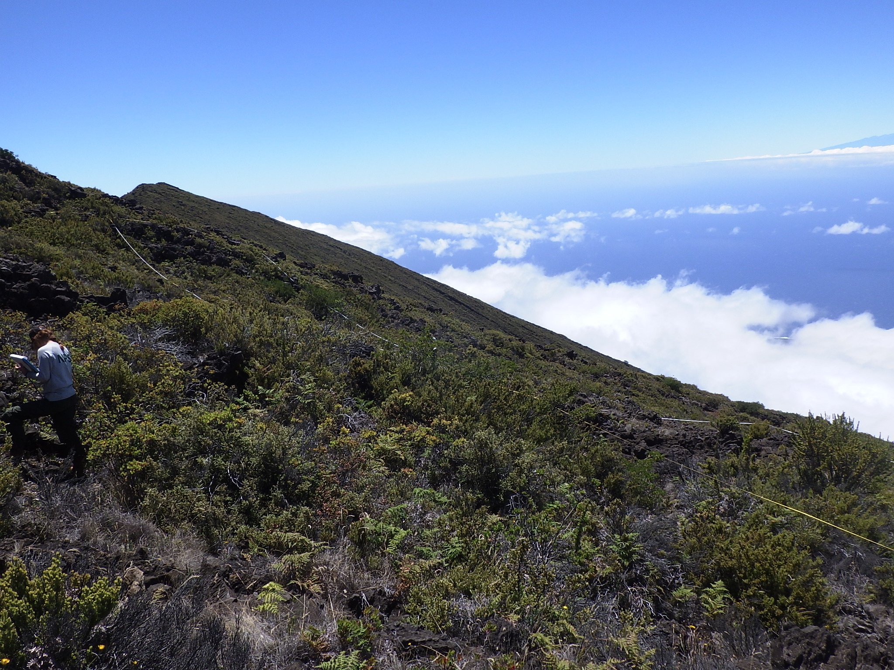

```{r setup, include=FALSE}
knitr::opts_chunk$set(echo = TRUE)
```

```{css caption-hack, echo=FALSE, eval=TRUE}

span.dummy-fig + div.figure > span {
  display: none !important;
}

span.dummy-fig + div.figure > img {
  display: none !important;
}

div.plotly {
  margin-bottom: 0px !important;
}
```

```{r packages, include=FALSE}
#library(tidyverse)
library(kableExtra)
library(leaflet)
library(pacnvegetation)
library(bookdown)
library(tidyverse)
library(here)
library(plotly)
library(treemapify)
library(data.table)
library(DT)
library(crosstalk)
library(htmltools)
library(sparkline)
```


```{r load data, include=FALSE}
access_dbs <- here(params$data_folder, params$access_dbs)

# Load the data
data <- LoadPACNVeg(ftpc_params = "pacnveg", eips_paths = access_dbs, 
                    cache = TRUE, force_refresh = FALSE)

# Get monitoring years
years <- get_years(params$sample_frame)
years_string <- paste(min(years), "-", max(years))

# Get monitoring cycles
cycles <- get_cycles(params$sample_frame)
```

---
title: "Vegetation Monitoring at Haleakala National Park: Subalpine Shrubland Plant Community `r years_string`"
---



# Background

The Pacific Island Inventory and Monitoring Network (PACN) monitors subalpine shrubland plant communities occurring along the slopes of Haleakala and Mauna Loa in Hawaii. This brief focuses on the Haleakala section which includes 4460 ha and consists of generally vegetated sites above 1980 m encompassing Haleakala summit, the park visitor center, headquarters, and several hiking trails open to the public.

```{r sampling-map, echo=FALSE, fig.cap= "All community plots (squares) and non-native transects (cirle with line) monitored within the Haleakala Subalpine Shrubland Plant Community. Fixed plots = blue; Rotational plots = red", message=FALSE, warning=FALSE}
MapPACNVeg2(sample_frame = params$sample_frame)
```

# Methods

15 fixed plots and 15 fixed transects were monitored in 2012 and again in 2017 
(Figure \@ref(fig:sampling-map)).

-   Understory Cover: Plant species understory cover was sampled within 50 x 20 m plots. Two height layers were recorded: 0-1 m from ground (Low) and 1-2 m from ground (High). Cover data was collected using the pole-intercept method (Ainsworth et al. 2011).

-   Invasive Plant Transects: Additional data on non-native plants were collected using frequency of occurrence along 500 m transects (Ainsworth et al. 2012).

# Results

## Understory - Species Composition

-   Species composition within HALE's subalpine shrubland is primary native shrubs and non-native grasses and herbs (Figure \@ref(fig:cover-composition-graph)).

-   The native shrub Leptecophylla tameiameiae had the highest average cover at 21.4% and occurred in 29/30 plots, followed by the non-native grass Holcus lanatus at 20.6% occuring in 22/30 plots (Table \@ref(tab:cover-composition-table)).

```{r echo=FALSE, message=FALSE, warning=FALSE}
# prep colors for sunburst plots
nativity_colors <- c("Native" = "#1b9e77", "No Veg" = "grey", "Non-Native" = "#d95f02", "Unknown" = "#7570b3")
mgmt_unit_colors <- c("#F8573A", "#F4C47B", "#28468B", "#AED5CB")

sunburst_all <- understorySunburst(params$sample_frame, params$cycle, mgmt_unit = FALSE, colors = nativity_colors)

sunburst_by_grp <- understorySunburst(params$sample_frame, params$cycle, mgmt_unit = TRUE, colors = mgmt_unit_colors)

bscols(sunburst_all, sunburst_by_grp, widths = c(6, 6))
```

```{r cover-composition-graph, echo=FALSE, fig.cap= paste0("Average understory species cover across the monitoring area from the most recent monitoring event (", max(years), "). Click on a section of the sunburst plot to drill down and click in the center to go back to the previous level of data."), message=FALSE, warning=FALSE, out.height="0px"}
# Dumb hack to get fig caption to show below plot + map
htmltools::span(class = "dummy-fig")
knitr::include_graphics(here("inst", "rmarkdown", "dummy_fig.PNG"))
```
<br/>
<br/>
```{r echo=FALSE, warning=FALSE, message=FALSE}
understoryBarCover(params$sample_frame)
```
```{r avg-cover-bar, echo=FALSE, fig.cap= "Average understory species cover across the monitoring area by management unit and monitoring cycle", message=FALSE, warning=FALSE, out.height="0px"}
# Dumb hack to get fig caption to show below plot + map
htmltools::span(class = "dummy-fig")
knitr::include_graphics(here("inst", "rmarkdown", "dummy_fig.PNG"))
```


```{r cover-composition-table, echo=FALSE, message=FALSE, warning=FALSE, tab.cap="Average understory species cover."}

und <- understorySpeciesCover(sample_frame = params$sample_frame) %>%
  dplyr::mutate(Cycle = as.factor(Cycle),
                all = "Select all",
                hovertext = paste(Scientific_Name, Nativity, paste0(Avg_Cover, "%"), sep = "\n")) %>%
  dplyr::filter(Avg_Cover > 0) %>%
  dplyr::group_by(GROUP_COL)

avg_cover_table <- und %>%
  select(Code, Cycle, Scientific_Name, Life_Form, Nativity, plots_present, Avg_Cover, Std_Dev) %>%
  mutate(Avg_Cover = Avg_Cover*100,
         Std_Dev = Std_Dev*100) %>%
  arrange(-Avg_Cover)

names(avg_cover_table) <- gsub("_", " ", names(avg_cover_table)) %>% str_to_title()  # Make column names nicer for display

add_table_caption("Average understory species cover.")
pacn_dt(avg_cover_table)
# cat("<table>",paste0("<caption>", "(\\#tab:avgcover)", " Average understory species cover.", "</caption>"),"</table>", sep ="\n")

# avg_cover_table %>%
#   kbl(digits = 1, align = "c",
#       caption = "Average understory species cover.") %>%
#   kable_styling(bootstrap_options = c("striped", "condensed")) %>%
#   scroll_box(height = "300px") 
```

## Understory - Total Cover

### Community Level

-   Almost all of the vegetation cover is concentrated below 1 m in height (i.e. the "Low" Stratum). An increase in non-native cover is suggested when summarizing Fixed and Rotational plots together across years (Figure \@ref(fig:bar-tot-cover-graph)).

```{r bar-tot-cover-graph, echo=FALSE, fig.cap=paste0("Total native and non-native cover from ", years[length(years)-1], "-", max(years), " (Mean +/- 95% CI). High = Understory 1-2 m; Low = Understory 0-1 m."), message=FALSE, warning=FALSE}
v_cover_plot_bar_nativity(sample_frame = params$sample_frame, paired_change = FALSE, param = "Cover")
```

### Plot Level

-   The majority of plots contain greater native cover compared to non-native cover. However, note the exception of plot #3 (Figure \@ref(fig:tot-cover-graph)).

-   Plot #3 has the most non-native cover (144%) and only ~1% native cover (Table \@ref(tab:tot-cover-table)).


```{r echo=FALSE, message=FALSE, warning=FALSE}
grp1 <- "cov_total"

plt1 <- UnderNativityCover.plot.nat_v_non(
  sample_frame = params$sample_frame,
  cycle = max(cycles),
  cycle_filter = FALSE,
  paired_change = FALSE,
  combine_strata = TRUE,
  crosstalk = TRUE,
  crosstalk_group = grp1,
  interactive = TRUE)

map1 <- MapCoverTotal(crosstalk = TRUE, 
                      crosstalk_group = grp1, 
                      sample_frame = params$sample_frame, 
                      cycle = max(cycles))

bscols(plt1, map1)
```


```{r tot-cover-graph, echo=FALSE, fig.cap= paste0("Native and non-native understory cover for the most recent monitoring (", max(years), "). Point numbers corrspond to fixed monitoring sites."), message=FALSE, warning=FALSE, out.height="0px"}
# Dumb hack to get fig caption to show below plot + map
htmltools::span(class = "dummy-fig")
knitr::include_graphics(here("inst", "rmarkdown", "dummy_fig.PNG"))
```

```{r tot-cover-table, echo=FALSE, message=FALSE, warning=FALSE}
cover_by_nativity <- UnderNativityCover(rm_unk_natv = TRUE, 
                                        cycle = max(cycles), 
                                        combine_strata = TRUE, 
                                        sample_frame = params$sample_frame, 
                                        paired_change = FALSE) %>%
  select(Plot_Number, Native_Percent_Cover = Native_Cover_Total_pct, Non_Native_Percent_Cover = NonNative_Cover_Total_pct) %>%
  arrange(-Non_Native_Percent_Cover)
names(cover_by_nativity) <- gsub("_", " ", names(cover_by_nativity)) %>% str_to_title()  # Make column names nicer for display

add_table_caption("Total understory cover per plot.")
pacn_dt(cover_by_nativity)

```

## Understory - Change in Cover 

### Community Level

-   Paired change in cover between fixed plots indicated both native and non-native vegetation is increasing. However, non-native vegetation increased 3 times faster between the two sampling periods within the 'Low' stratum (Figure \@ref(fig:bar-tot-cover-chg-graph)).

```{r bar-tot-cover-chg-graph, echo=FALSE, fig.cap=paste0("Total change in native and non-native cover from ", years[length(years)-1], "-", max(years), " (Mean +/- 95% CI). High = Understory 1-2 m; Low = Understory 0-1 m."), message=FALSE, warning=FALSE}
v_cover_plot_bar_nativity(sample_frame = params$sample_frame, paired_change = TRUE, param = "Chg_Per_Year")
```

### Plot Level 

-   Most fixed plots showed increases in both native and non-native understory cover, with ratios favoring greater increases in non-native cover (Figure \@ref(fig:chg-cover-graph)).

-   Plot #2 showed the greatest increase in non-native percent cover (43), while Plot #10 showed the greatest decrease in native percent cover (-14.3) (Table \@ref(tab:chg-cover-table)).

-   Hover over a point in the graph to see it highlighted on the map. Double click anywhere in the graph to deselect.

```{r echo=FALSE, message=FALSE, warning=FALSE}
grp <- "cov_change"

plt <- UnderNativityCover.plot.nat_v_non(sample_frame = params$sample_frame, 
                                  cycle = max(cycles), 
                                  paired_cycle = min(cycles),
                                  paired_change = TRUE,
                                  combine_strata = TRUE,
                                  crosstalk = TRUE,
                                  crosstalk_group = grp,
                                  interactive = TRUE)

map <- MapCoverChange(crosstalk = TRUE, crosstalk_group = grp, sample_frame = params$sample_frame, cycle = max(cycles), paired_cycle = min(cycles))

bscols(plt, map)
```

```{r chg-cover-graph, echo=FALSE, fig.cap= paste0("Change in native vs. non-native cover from ", years[length(years)-1], "-", max(years), ". Point numbers correspond to fixed monitoring sites."), message=FALSE, warning=FALSE, out.height="0px"}
# Dumb hack to get fig caption to show below plot + map
htmltools::span(class = "dummy-fig")
knitr::include_graphics(here("inst", "rmarkdown", "dummy_fig.PNG"))
```

## Invasive Plant Transect Data

``` 
# 1-2 graphs & 1-2 tables 

(not appropriate for all sites - for example, no transects monitored at some sites)

```
```{r}
test_data <- v_EIPS_prep(sample_frame = params$sample_frame)

### Non-Native Species
v_EIPS_map_interstation(.data = test_data,
                        parameter = "Mean_Species_Cover",
                        change = FALSE)
                        
### Total Non-Native Cover
v_EIPS_map_interstation(.data = test_data,
                        parameter = "Mean_Total_Cover",
                        change = FALSE,
                        agol_sample_frame = "Haleakalā Subalpine")  # TODO: create sample frame to AGOL sample frame crosswalk


### Non-Native Richness
v_EIPS_map_interstation(.data = test_data,
                        parameter = "Max_Richness",
                        change = FALSE)

### Non-Native Species Change
v_EIPS_map_interstation(.data = test_data,
                        parameter = "Mean_Species_Cover",
                        change = TRUE)
```

## Tree Data

``` 
# 1-3 graphs & 1-3 tables 

1. Total Native vs. Non-native Basal Area
2. Change in Native & Non-native Basal Area
3. Basal Area total & change for a particular species of interest (site specific). 

(not appropriate for all sites - for example, no Trees in Haleakala subalpine) 

```
## Shrub / Tree-fern / Vine Data

``` 
# 1-3 graphs & 1-3 tables 

1. Count/ha of Native vs. Non-native 
2. Change in count/ha of Native & Non-native 
3. Particular species of interest (site specific). 


```

# Summary

-   Summary text here.

-   Summary text here.

-   Summary text here.


# References

| [Ainsworth, A., J.D. Jacobi, R. K. Loh, J.A. Christian, C. Yanger, and P. Berkowitz. 2012. Established invasive plant species monitoring protocol: Pacific Island Network. Natural Resource Report NPS/ PACN/NRR---2012/514. National Park Service, Fort Collins, Colorado.](https://irma.nps.gov/DataStore/DownloadFile/448810)
|
| [Ainsworth, A., Berkowitz, P., Jacobi, J.D., Loh, R.K., & Kozar, K. 2011. Focal Terrestrial Plant Communities Monitoring Protocol: Pacific Island Network. Natural Resource Report NPS/PACN/NRR---2011/410. National Park Service, Fort Collins, Colorado.](https://irma.nps.gov/DataStore/DownloadFile/429572)

## More Information

| Ryan Monello, PACN I&M Program Manager
| ryan_monello\@nps.gov, 808-985-6183
| 
| Jacob Gross, Botanist
| Jacob_Gross\@nps.gov, 808-985-6187
| 
| [Vital Signs: Pacific Island Inventory & Monitoring Network](https://www.nps.gov/im/pacn/monitoring.htm)
| [Reports & Publications (U.S. National Park Service) (nps.gov)](https://www.nps.gov/im/pacn/reports-publications.htm)


```{js fix-filtering, echo=FALSE, message=FALSE, warning=FALSE}
function filter_default(){
  document.getElementById("show_all").style.display = "none";
  document.getElementById("show_all").getElementsByClassName("selectized")[0].selectize.setValue("Select all", false);
}
    
$(document).ready(filter_default);
```
